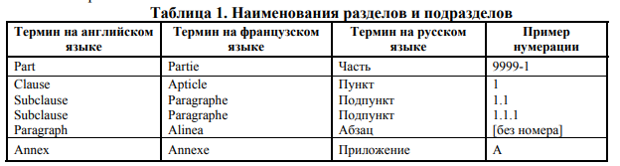

## ISO/IEC 24762 
- Назначение документов, публикуемых ISO и IEC, состоит в четком и однозначном определении положений с целью содействия международной торговле и общению. 
- Единство структуры, стиля и терминологии должно поддерживаться не только внутри каждого документа, но и внутри нескольких связанных между собой документов. 
- Документы настолько различны, что установить какие-либо универсально приемлемые правила для подразделения их объектов невозможно. Однако общее правило гласит, что для каждого стандартизуемого объекта должен создаваться и публиковаться как единое целое отдельный документ.

