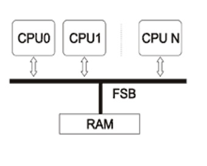

# Архитектуры

Все процессоры имеют равноправный доступ к памяти. Память равноудалена от всех процессоров.
Это так называемые **SMP (Symmetric Multi-Processing)**, симметричные процессорные системы.
Как видно из иллюстрации все процессоры связаны с общей памяти через **FSB (Front Side Bus)**.
Эта же шина и является узким местом такой архитектуры, поскольку ее пропускная способность
должна удовлетворять запросы каждого процессора, даже если они поступают одновременно.
Именно поэтому **SMP системы почти не масштабируются**, два-три десятка процессоров для них – это уже теоретический предел.
