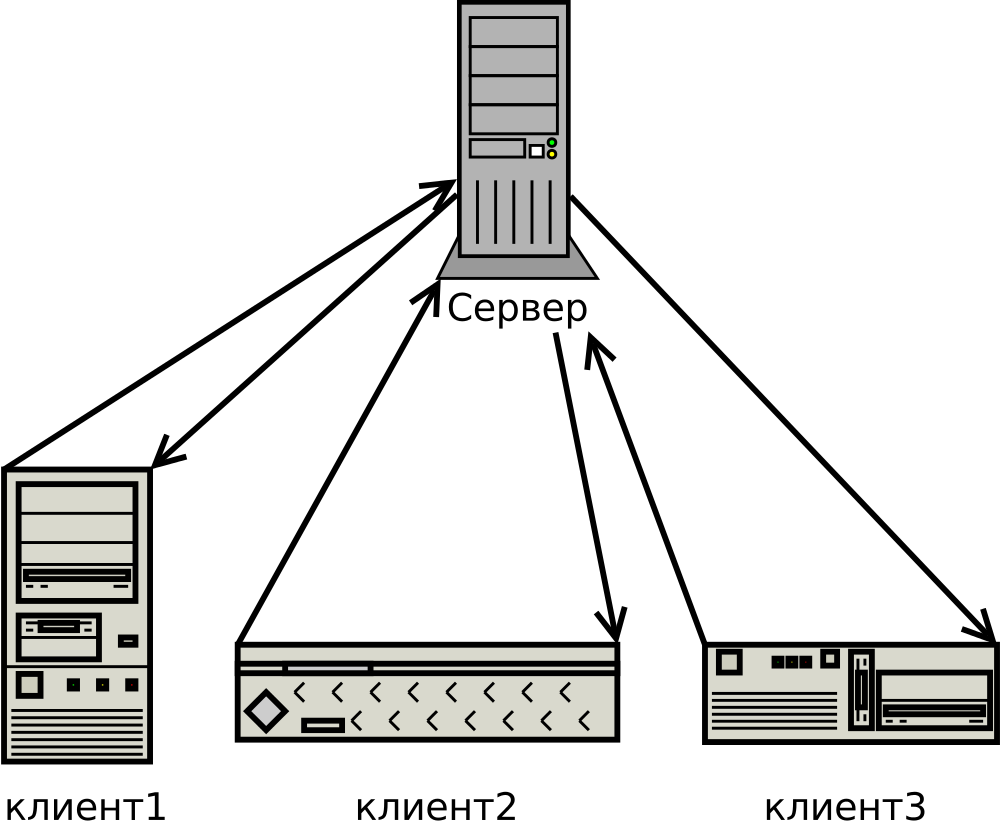

# Клиент — Сервер

**Клиент — сервер** (англ. client–server) — **вычислительная или сетевая архитектура**, в которой задания или сетевая нагрузка распределены между поставщиками услуг, называемыми серверами, и заказчиками услуг, называемыми клиентами. Фактически **клиент и сервер — это программное обеспечение**. Обычно эти программы расположены на разных вычислительных машинах и взаимодействуют между собой через вычислительную сеть посредством сетевых протоколов, но они могут быть расположены также и на одной машине.

<!-- _footer: Коржов В. Многоуровневые системы клиент-сервер. [Электронный ресурс]. URL: http://www.osp.ru/nets/1997/06/142618/ (дата обращения: 23.03.2020)-->
