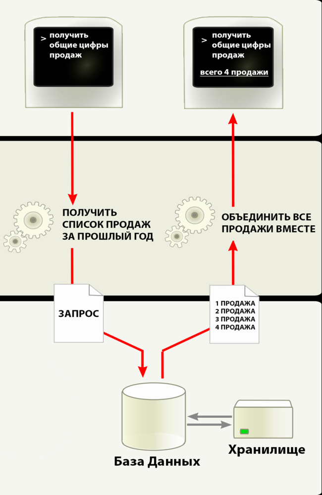

# Трехуровневая архитектура 
### **Слой клиента** 
Самый верхний уровень приложения с интерфейсом пользователя. 
Главная функция интерфейса представление задач и результатов, понятных пользователю. 
### **Слой логики** 
Этот слой координирует программу, обрабатывает команды, выполняет логические решения и вычисления, выполняет расчеты. 
Она также перемещается и обрабатывает данные между двумя окружающими слоями. 
### **Слой данных** 
Здесь хранится информация и извлекается из базы данных и файловой системы. Информация отправляется в логический слой для 
обработки и в конечном счете возвращается пользователю. 

