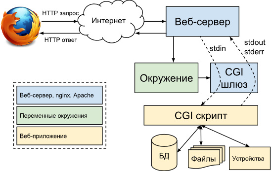

# CGI
**CGI** (от англ. *Common Gateway Interface* — «общий интерфейс шлюза») — **стандарт интерфейса**, используемого для связи внешней 
программы с веб-сервером. Программу, которая работает по такому интерфейсу совместно с веб-сервером, 
принято называть шлюзом, хотя многие предпочитают названия «скрипт» (сценарий) или «CGI-программа».

## Как работает CGI?
1. Клиент запрашивает CGI-приложение по его URI.
2. Веб-сервер принимает запрос и устанавливает переменные окружения, через них приложению передаются данные и служебная информация.
3. Веб-сервер перенаправляет запросы через стандартный поток ввода (stdin) на вход вызываемой программы.
4. CGI-приложение выполняет все необходимые операции и формирует результаты в виде HTML.
5. Сформированный гипертекст возвращается веб-серверу через стандартный поток вывода (stdout). Сообщения об ошибках передаются через stderr.
6. Веб-сервер передает результаты запроса клиенту.

<!--_footer: Хабр. Пример простейшего cgi сервера [Электронный ресурс]. URL: https://habr.com/ru/post/254621/ -->
