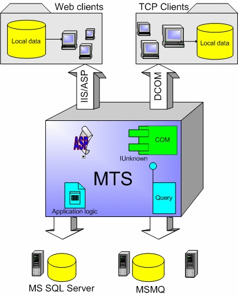

# DCOM
***DCOM* - программная архитектура, разработанная компанией Microsoft для распределения приложений между несколькими компьютерами в сети. Программный компонент на одной из машин может использовать **DCOM** для передачи сообщения (его называют удаленным вызовом процедуры) к компоненту на другой машине. **DCOM** автоматически устанавливает соединение, передает сообщение и возвращает ответ удаленного компонента.**

**COM** и **DCOM** - технологии, обеспечивающие взаимодействие между компонентами приложения и позволяющие развертывать распределенное приложение на платформе Windows. **COM** является моделью программирования на основе объектов, которая упрощает взаимодействие различных приложений и компонентов, а **DCOM** - это своего рода "клей", связывающий воедино разнообразные технологии, применяемые в распределенных приложениях. 

**DCOM** дает возможность двум или нескольким компонентам легко взаимодействовать друг с другом независимо от того, когда и на каком языке программирования они были написаны, а также где именно они находятся и в какой операционной системе работают.

<!-- _footer: Частное Боровское исследовательское учреждение по внедрению новых технологий [Электронный ресурс]. - Режим доступа: http://bourabai.ru/alg/com.htm (дата обращения: 23.03.2020)-->

